<h2>

Active Directory Lab – Part 2: Firewall Configuration & Connectivity Verification
</h2>

This section is a <strong>continuation of Part 1</strong> of the Active Directory lab environment setup.  
In Part 1, the Azure infrastructure was created, including the resource group, virtual network, Domain Controller VM, and Client VM.  
The Domain Controller was also assigned a static private IP address, and the client machine was configured to use that address as its DNS server.

In this section, we will verify connectivity to the Domain Controller and temporarily adjust firewall settings so communication between systems inside the lab environment can be tested.

 

<h3>Connecting to the Domain Controller via Remote Desktop</h3>

To begin configuring the server, connect to the <strong>Domain Controller (DC-01)</strong> using Remote Desktop Protocol (RDP).  
From the Azure Portal, locate the Domain Controller virtual machine and identify its <strong>public IP address</strong>.

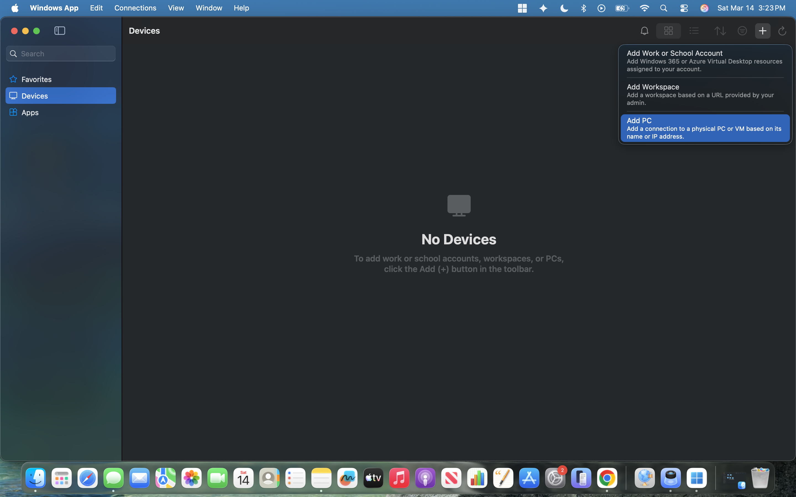

Using the Remote Desktop client, create a new connection to the Domain Controller using the public IP address assigned to the virtual machine.

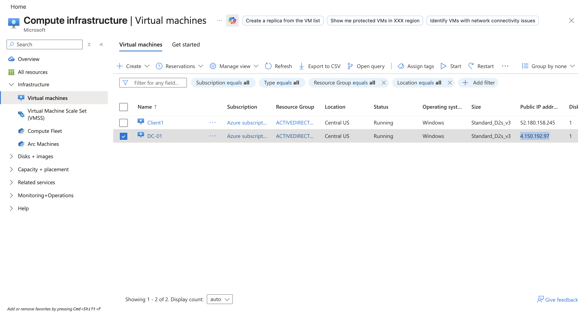

Enter the administrator credentials that were configured during the virtual machine deployment in Part 1.

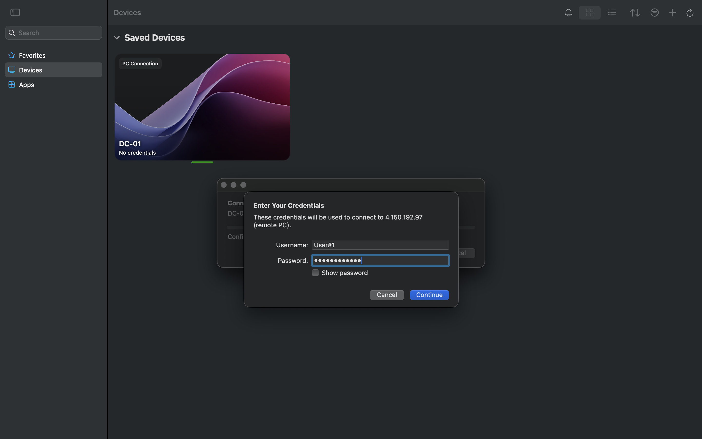

A certificate warning may appear when connecting through RDP because the connection is using a self-signed certificate generated by the system.  
For the purpose of this lab environment, select <strong>Continue</strong> to proceed with the connection.

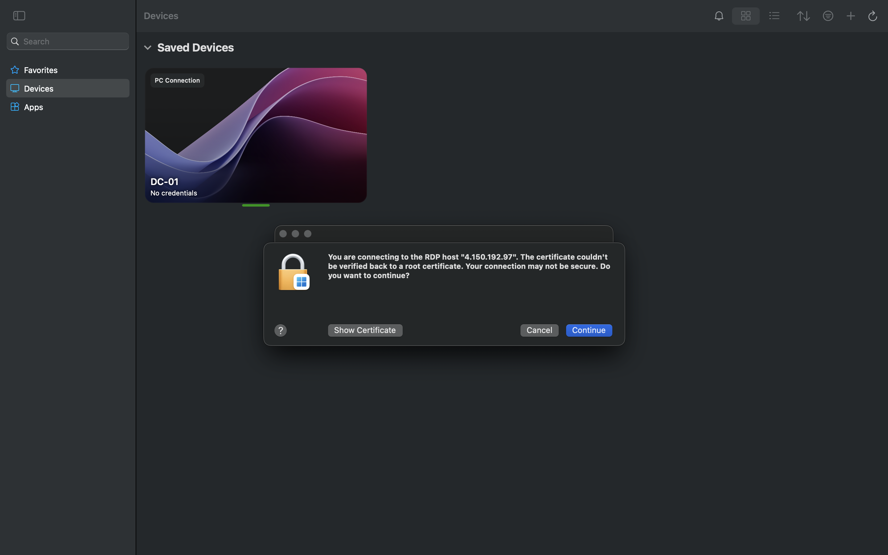

Once connected, the Windows Server desktop for the Domain Controller will appear.

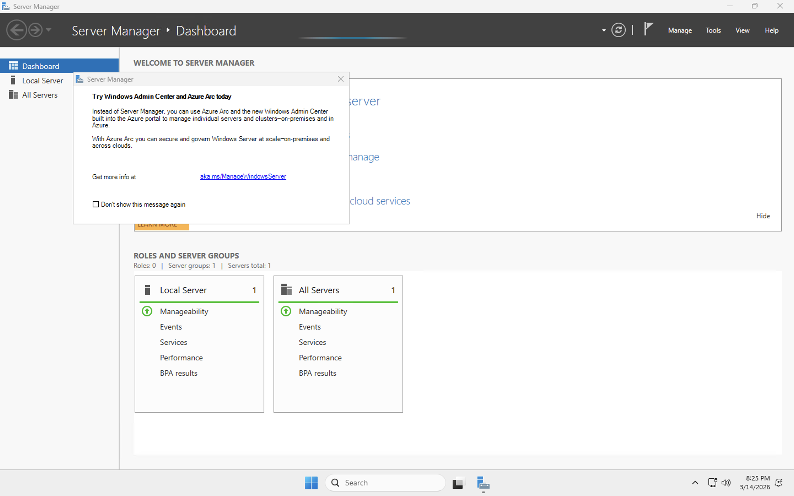

 

<h3>Preparing the Server for Connectivity Testing</h3>

After logging into the Domain Controller, open the system management options by right-clicking the <strong>Start Menu</strong>.  
This menu provides quick access to administrative tools such as Event Viewer, Device Manager, and network configuration utilities.

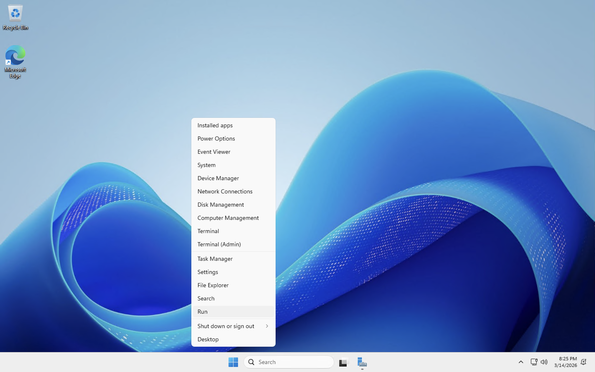

In the next steps of the lab, the Windows Firewall will be temporarily adjusted so network communication between the Domain Controller and the client system can be tested.

<strong>Important:</strong> Disabling or modifying firewall settings is generally <strong>not recommended in production environments</strong>.  
Firewalls act as a critical security control that helps prevent unauthorized access and malicious network activity.  
In real enterprise environments, administrators typically create specific firewall rules rather than disabling the firewall entirely.

For this lab environment, the firewall configuration will be adjusted temporarily to simplify testing and demonstrate communication between the systems within the isolated Azure network.

 

<h3>Opening Windows Defender Firewall Settings</h3>

To begin adjusting the firewall settings, open the <strong>Run</strong> dialog by pressing <strong>Windows + R</strong>. 
In the Run window, type <strong>wf.msc</strong> and press Enter. 
This command opens the <strong>Windows Defender Firewall with Advanced Security</strong> management console.

The Windows Defender Firewall with Advanced Security console provides detailed control over firewall policies, inbound rules, outbound rules, and connection security rules.

 

<h3>Disabling the Domain Firewall Profile</h3>

Open the <strong>Windows Defender Firewall Properties</strong> panel to modify the firewall configuration.

Under the <strong>Domain Profile</strong> tab, change the firewall state from <strong>On</strong> to <strong>Off</strong>.

This action disables the firewall when the machine is operating within a domain network environment.

 

<h3>Disabling the Private Firewall Profile</h3>

Next, navigate to the <strong>Private Profile</strong> tab and change the firewall state to <strong>Off</strong>.

Private network profiles are typically used for trusted internal networks such as corporate LAN environments.

 

<h3>Disabling the Public Firewall Profile</h3>

Finally, open the <strong>Public Profile</strong> tab and set the firewall state to <strong>Off</strong>.

After applying these changes, the firewall will be disabled across all network profiles on the server.

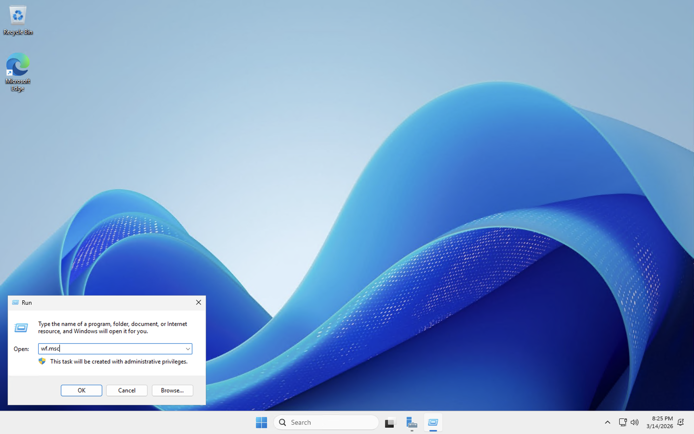

<strong>Important:</strong> Disabling the firewall is generally <strong>not recommended</strong> in real-world environments. 
Firewalls serve as a critical security control that protects systems from unauthorized network access, malicious traffic, and potential attacks.

In enterprise environments, administrators typically create <strong>specific firewall rules</strong> that allow required services while keeping the firewall enabled. 
For the purpose of this lab environment, the firewall is temporarily disabled to simplify connectivity testing between the Domain Controller and client virtual machine.

 

<h3>Verifying Network Connectivity</h3>

Once the firewall has been disabled, the next step is to verify communication between the client machine and the Domain Controller.

Open the Command Prompt and use the <strong>ping</strong> command to test connectivity to the Domain Controller's private IP address.

Successful ping responses confirm that the client machine can communicate with the Domain Controller across the virtual network.

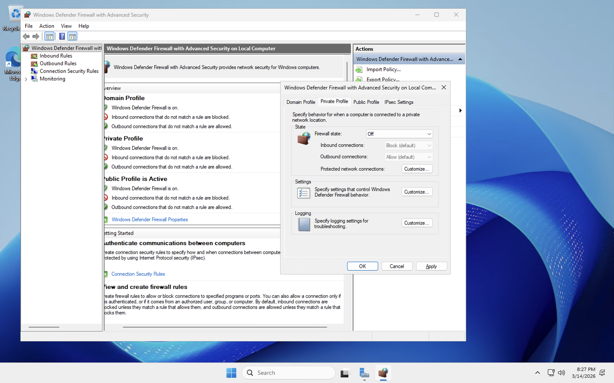

This verifies that the networking configuration, DNS settings, and virtual network connectivity are functioning properly.

 

<h3>Lab Environment Ready for Active Directory Installation</h3>

With connectivity confirmed and firewall restrictions temporarily removed, the environment is now ready for the next stage of the lab: installing and configuring <strong>Active Directory Domain Services (AD DS)</strong> on the Domain Controller.

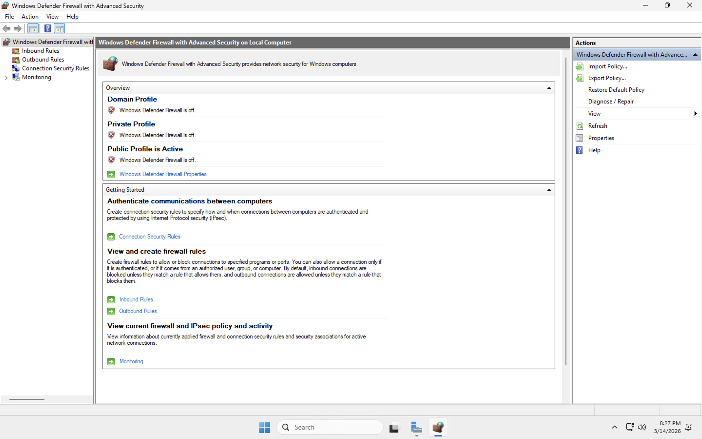

 

<h3>Connecting to the Client Virtual Machine</h3>

After verifying the Domain Controller configuration, the next step is to connect to the <strong>Client1</strong> virtual machine to confirm that the client system can communicate with the Domain Controller.

From the Azure Portal, locate the <strong>Client1</strong> virtual machine and note its assigned <strong>public IP address</strong>.

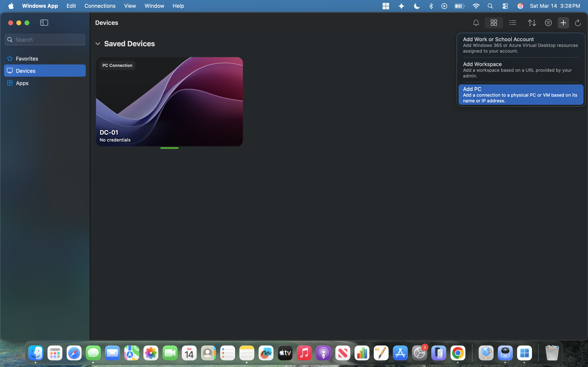

Open the Remote Desktop client and create a new connection for the client machine using the public IP address assigned to <strong>Client1</strong>.

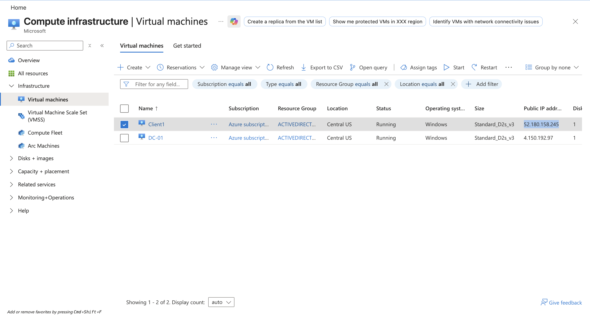

Once the connection is added, launch the session and sign in using the administrator credentials configured earlier during the Client VM deployment.

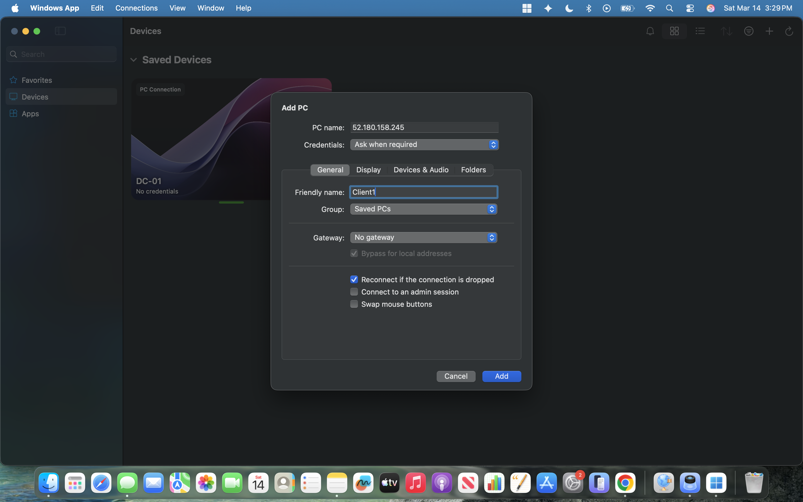

After authentication completes, the Windows 11 desktop for the client machine will load successfully.

 

<h3>Running Connectivity Verification from the Client Machine</h3>

To verify communication with the Domain Controller, open <strong>Windows PowerShell</strong> as an administrator on the client machine.

Use the <strong>ping</strong> command to test connectivity to the Domain Controller’s private IP address <strong>10.0.0.4</strong>.

The successful replies confirm that <strong>Client1</strong> can communicate with the Domain Controller across the internal Azure virtual network.
This verifies that the virtual network, static IP configuration, DNS settings, and temporary firewall adjustments are functioning as intended.

To further confirm the client’s network configuration, run <strong>ipconfig /all</strong> in PowerShell.

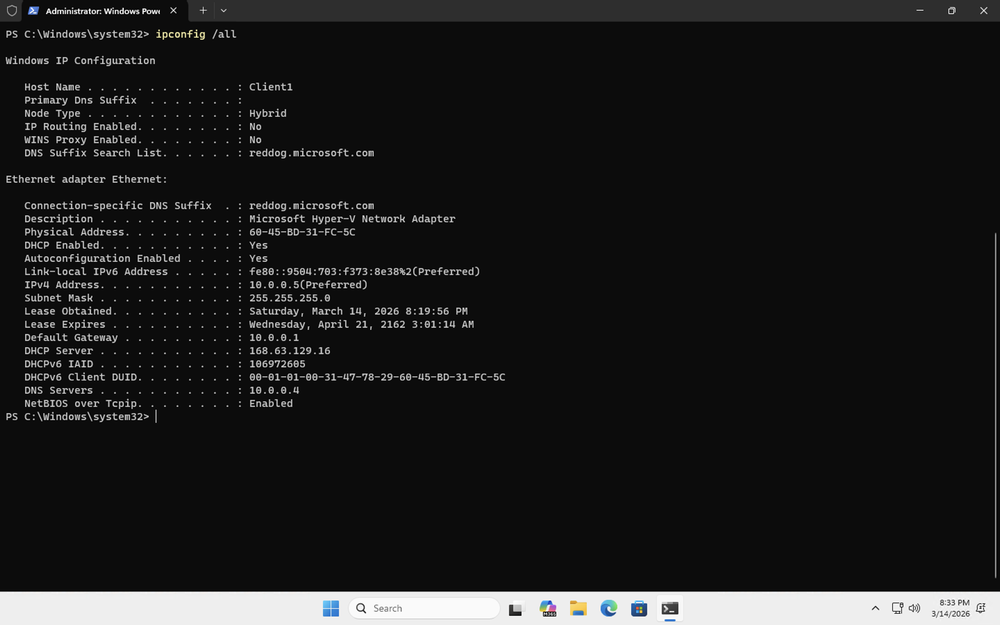

The output confirms that the client machine is using the Domain Controller’s private IP address <strong>(10.0.0.4)</strong> as its DNS server.
This is an important verification step because Active Directory relies on DNS for locating domain services, domain controllers, and authentication resources.

 

<h3>Setup and Verification Complete</h3>

At this stage, the initial Active Directory lab setup and verification process is complete.
Both virtual machines have been deployed successfully, the Domain Controller has been assigned a static private IP address, the client machine has been configured to use that address for DNS, and connectivity between the systems has been verified.

This concludes the infrastructure and communication setup portion of the lab environment. 
The environment is now ready for the next phase, where Active Directory Domain Services can be installed and configured on the Domain Controller.

